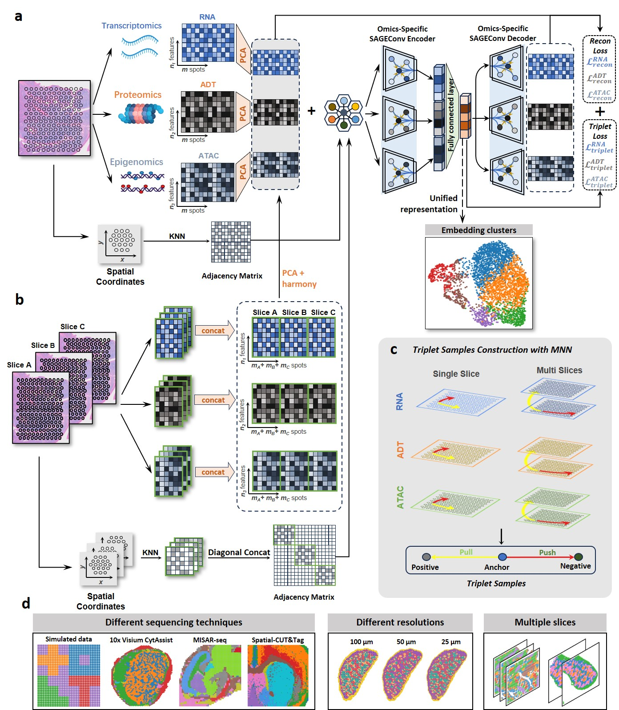

Welcome to SMART's documentation!
========================================

.. SMART documentation master file, created by
   sphinx-quickstart on Mon Aug 25 16:01:51 2025.
   You can adapt this file completely to your liking, but it should at least
   contain the root `toctree` directive.

Spatial multi-omic aggregation using graph neural networks and metric learning
=====================================================================================================================================================

Overview
========
Spatial multi-omics enables the exploration of tissue microenvironments and heterogeneity from the perspective of different omics modalities across distinct spatial domains within tissues. To jointly analyze the spatial multi-omics data, computational methods are desired to integrate multiple omics with spatial information into a unified space. Here, we present SMART (Spatial Multi-omic Aggregation using gRaph neural networks and meTric learning), a computational framework for spatial multi-omic integration. SMART leverages a modality-independent modular and stacking framework with spatial coordinates and adjusts the aggregation using triplet relationships. SMART excels at accurately identifying spatial regions of anatomical structures, compatible with spatial datasets of any type and number of omics layers, while demonstrating exceptional computational efficiency and scalability on large datasets. Moreover, a variant of SMART, SMART-MS, expands its capabilities to integrate spatial multi-omics data across multiple tissue sections. In summary, SMART provides a versatile, efficient, and scalable solution for integrating spatial multi-omics data.

Getting started with SMART
==========================

To begin using **SMART**, please refer to the following sections of the documentation:

- The :doc:`Installation <installation>` provides instructions for setting up **SMART** in your environment.

- The :doc:`Tutorials <tutorials/index>` contains examples on how to use **SMART** for various integration and imputation tasks.

Citation
========
Zhihua Du, Qiyi Chen, Weiliang Huang, Jinmiao Chen & Xubin Zheng. SMART: Spatial multi-omic aggregation using graph neural networks and metric learning. 2024.

.. toctree::
   :maxdepth: 3
   :caption: Contents:
   
   installation
   tutorials/index
   api/index
   datasets
   credits